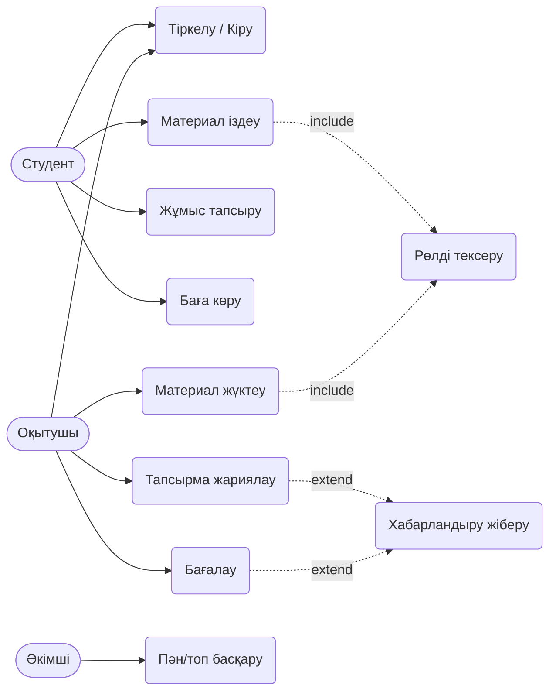
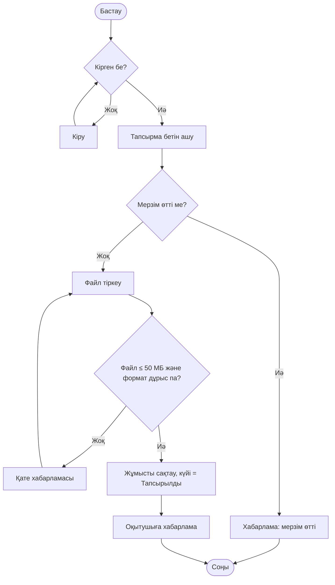

# 10-жұмыс. Mermaid: Use Case және Activity (GitHub-та тікелей көрінеді)
## Use Case: UMP

```mermaid
flowchart LR
  S([Студент]) --> A1(Тіркелу / Кіру)
  S --> A3(Материал іздеу)
  S --> A5(Жұмыс тапсыру)
  S --> A7(Баға көру)
  T([Оқытушы]) --> A1
  T --> A2(Материал жүктеу)
  T --> A4(Тапсырма жариялау)
  T --> A6(Бағалау)
  AD([Әкімші]) --> A8(Пән/топ басқару)
  A3 -. include .-> A9(Рөлді тексеру)
  A2 -. include .-> A9
  A4 -. extend .-> N(Хабарландыру жіберу)
  A6 -. extend .-> N
```
## Activity: «Жұмыс тапсыру» сценарийі

```mermaid
flowchart TD
  Start([Бастау]) --> Login{Кірген бе?}
  Login -- Жоқ --> Auth[Кіру] --> Login
  Login -- Иә --> Open[Тапсырма бетін ашу]
  Open --> Dl{Мерзім өтті ме?}
  Dl -- Иә --> Err[Хабарлама: мерзім өтті] --> End([Соңы])
  Dl -- Жоқ --> File[Файл тіркеу]
  File --> Size{Файл ≤ 50 МБ және формат дұрыс па?}
  Size -- Жоқ --> Err2[Қате хабарламасы] --> File
  Size -- Иә --> Save[Жұмысты сақтау, күйі = Тапсырылды]
  Save --> Notify[Оқытушыға хабарлама] --> End
```
