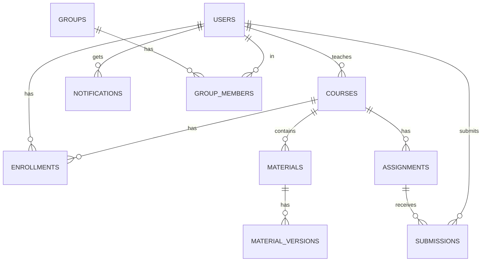

# 12-жұмыс. ERD (schema.sql үшін)

```mermaid
erDiagram
  USERS ||--o{ ENROLLMENTS : has
  COURSES ||--o{ ENROLLMENTS : has
  USERS ||--o{ COURSES : teaches
  COURSES ||--o{ MATERIALS : contains
  MATERIALS ||--o{ MATERIAL_VERSIONS : has
  COURSES ||--o{ ASSIGNMENTS : has
  ASSIGNMENTS ||--o{ SUBMISSIONS : receives
  USERS ||--o{ SUBMISSIONS : submits
  USERS ||--o{ NOTIFICATIONS : gets
  GROUPS ||--o{ GROUP_MEMBERS : has
  USERS ||--o{ GROUP_MEMBERS : in
```
Ескерту: SQL файлы Python `sqlite3` арқылы тексерілді, 10 кесте қатесіз құрылды.
